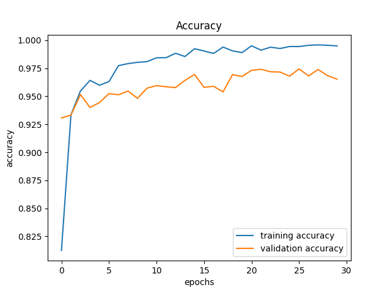
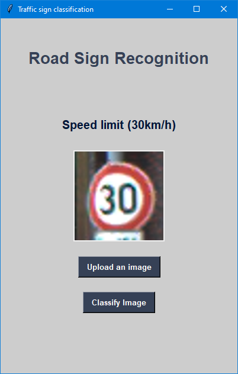

# Road Sign Recognition

An application written in Python that classifies road signs. The classification is done using a convolutional neural network (CNN).

## Table of Contents

* [General Info](#general-information)
* [Screenshot](#screenshot)
* [Features](#features)
* [Setup](#setup)
* [Contact](#contact)

## General Information

The applications allows to classify road signs of 43 categories with 90% accuracy.

It is one of the projects which I have developed during my studies. Through this project, I could learn about deep neural networks and
improve my skills with writing scripts in Python. I got inspired to start working on it by this blog post: 
https://data-flair.training/blogs/python-project-traffic-signs-recognition/.

For this project, I used the public dataset available at Kaggle: https://www.kaggle.com/meowmeowmeowmeowmeow/gtsrb-german-traffic-sign.
The dataset contains more than 50,000 images of different traffic signs. It is further classified 
into 43 different classes. The size of the it is around 300 MB. The dataset has 
a train folder which contains images inside each class and a test folder which is later used to test the model.

Several Python libraries were used to transform the data in order to classify it:
- Numpy (library used for working with arrays) 
- Pandas (reading a .csv file) 
- Matplotlib (plotting) 
- Keras (used to build the CNN) 
- Sklearn (split the dataset into training and testing) 
- Pillow (PIL) (open an image)

The repository contains 2 Python scripts. The first one, *CNN.py* is responsible for building, training, validating and then testing
the CNN model. After the model is trained, the user can launch the other script - *gui.py*. It's an app with a graphical interface,
where the user can upload a picture of a road sign and then click a button to classify it.

By default, the model is trained with 30 epochs. Below you can see a graph showing the training and validation accuracy for each 
epoch.

To test the model in in a somewhat real-life scenario it got tested with images which the model has not encountered before. The accuracy
result for the model trained with 30 epochs is equal to 90%.

## Screenshot

## Features

The application can classify pictures of road signs of 43 classes. Below you can find what kind of a road sign each class represents:
1: Speed limit (20km/h) 
2: Speed limit (30km/h) 
3: Speed limit (50km/h) 
4: Speed limit (60km/h) 
5: Speed limit (70km/h) 
6: Speed limit (80km/h) 
7: End of speed limit (80km/h) 
8: Speed limit (100km/h) 
9: Speed limit (120km/h) 
10: No passing 
11: No passing vehicles over 3.5 tons 
12: Right-of-way at intersection 
13: Priority road 
14: Yield 
15: Stop 
16: No vehicles 
17: Vehicles > 3.5 tons prohibited 
18: No entry 
19: General caution 
20: Dangerous curve left 
21: Dangerous curve right 
22: Double curve 
23: Bumpy road 
24: Slippery road 
25: Road narrows on the right  
26: Road work 
27: Traffic signals 
28: Pedestrians 
29: Children crossing 
30: Bicycles crossing 
31: Beware of ice/snow 
32: Wild animals crossing 
33: End speed + passing limits 
34: Turn right ahead 
35: Turn left ahead 
36: Ahead only 
37: Go straight or right 
38: Go straight or left 
39: Keep right 
40: Keep left 
41: Roundabout mandatory 
42: End of no passing 
43: End no passing vehicles > 3.5 tons

## Setup

To run the *CNN.py* script and build the model, firstly you need to download the dataset and extract it. Then you can run the script in
the main folder of the dataset.

After the model is trained, it will be saved as *model.h5* file. Then you can run the *gui.py* script to launch the application with
graphical interface.

## Contact

Created by Rafał Bogdanowicz - feel free to contact me by e-mail: <bogdaraf@gmail.com>